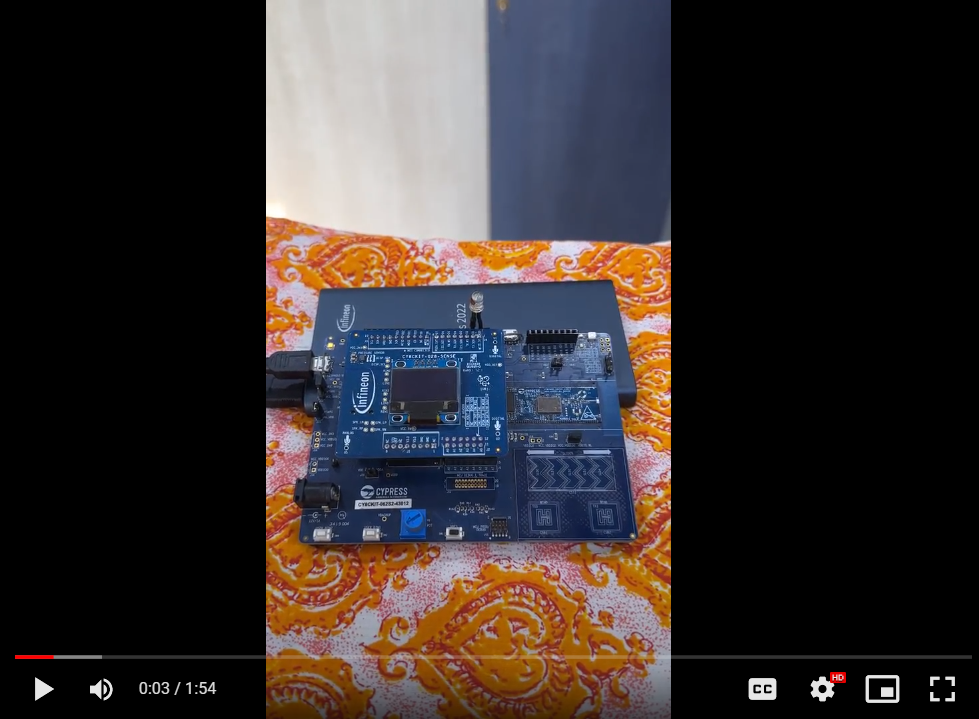

# HMM-GMM based Speech Recognition System

## Overview
This repository contains the MATLAB and C source code for speech recognition system based on HMM-GMM. 

This project was done as part of IITM Mtech coursework for the course "EE5110W : Probability Foundations for Electrical Engineers".

## Hardware Demo Video

